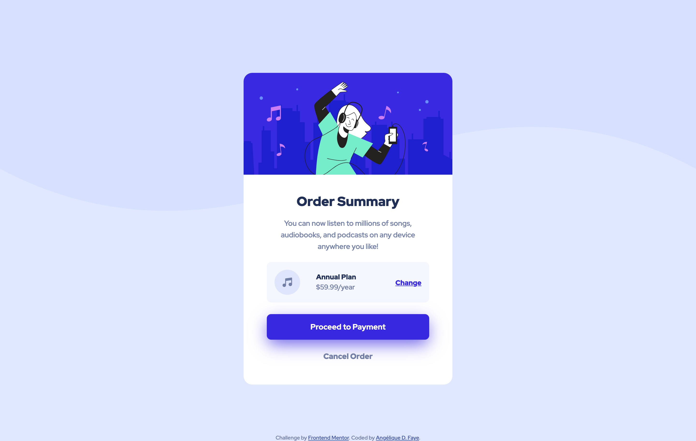
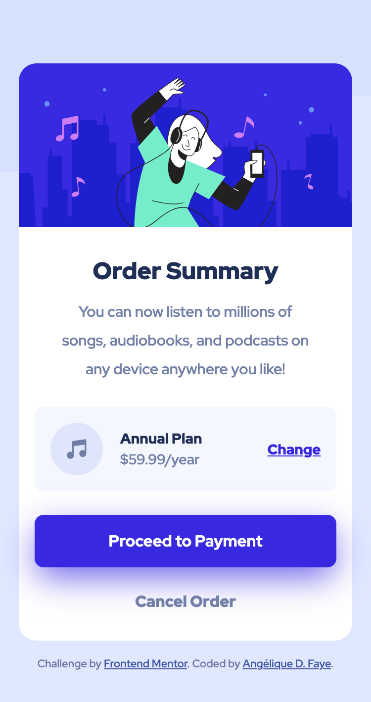

- [Order Summary Component challenge](#order-summary-component-challenge)
  - [Overview](#overview)
  - [Links](#links)
  - [How to run the project](#how-to-run-the-project)
  - [The challenge](#the-challenge)
  - [Description](#description)
  - [Features](#features)
  - [Technologies](#technologies)
  - [How I built this project](#how-i-built-this-project)
    - [What I learned](#what-i-learned)
  - [Sources](#sources)
  - [Useful references](#useful-references)
  - [Useful extensions](#useful-extensions)

# Order Summary Component challenge

  
  

  
  

## Overview

*A tiny component to present an order summary.*

 

## Links

<a href="/.github/README.md">GitHub repo</a> • <a href="/.github/CONTRIBUTING.md">Live demo </a>

 

## How to run the project

1. ``git clone HTTPS_REPO_URL MY-FOLDER-NAME``
2. ``cd MY-FOLDER-NAME``
3. ``npm install``
4. `` npm start ``
5. visit [http://localhost:1234](``http://localhost:1234``)

 

## The challenge

> Your users should be able to:
> - See hover states for interactive elements.
> 
> *[From Frontend Mentor](https://www.frontendmentor.io/challenges/order-summary-component-QlPmajDUj)*

## Description

This project is a component presenting an order summary for a digital streaming service. 

## Features

- Responsive.
- Semantic and accessible HTML5.
- CSS written with SCSS.

 

## Technologies

- Semantic ``HTML5``.
- ``SCSS``.
- ``Flexbox``.
- Bundled with ``Parcel.js``.

## How I built this project

 1. Started by structuring the page with semantic and accessible HTML.
 2. Styled the page with a mobile-first approach.

### What I learned

I added ``Parcel`` to have an idea of how to use it compared to ``Webpack`` and ``Gulp``. I didn't have to write any JavaScript or add any loader, even for SCSS support! This was ideal for such a small project.

The most challenging part was choosing the right HTML elements. And I still find that I relied to much on ``
`` elements.

Any suggestion on the markup is welcome!

 

## Sources

- [Order summary component by Frontend Mentor](https://www.frontendmentor.io/challenges/order-summary-component-QlPmajDUj)

## Useful references

1. [Why You Should Choose HTML5 article Over section](https://www.smashingmagazine.com/2020/01/html5-article-section/)

## Useful extensions

- [W3C Web Validator - Visual Studio Marketplace](https://marketplace.visualstudio.com/items?itemName=CelianRiboulet.webvalidator)